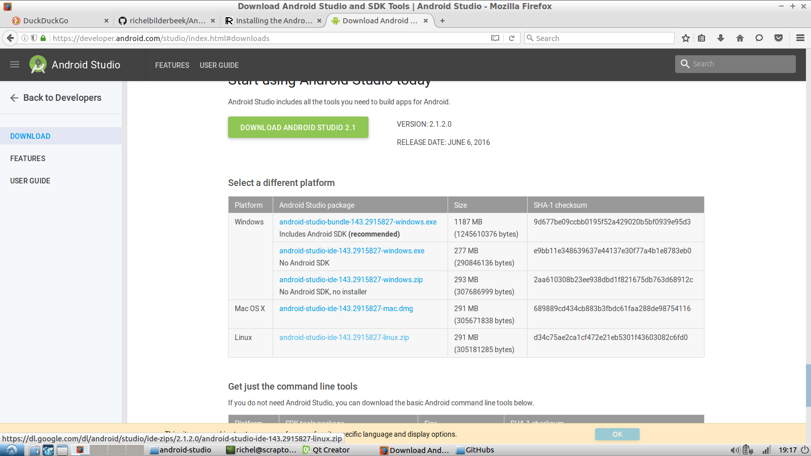
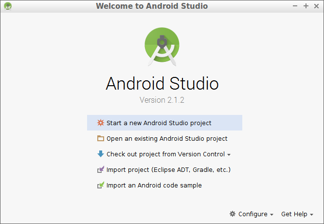
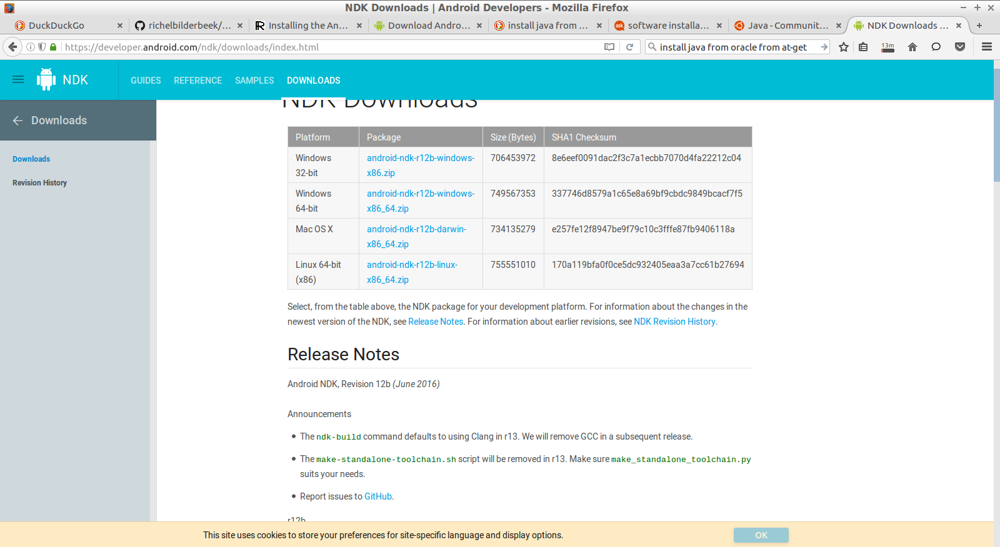
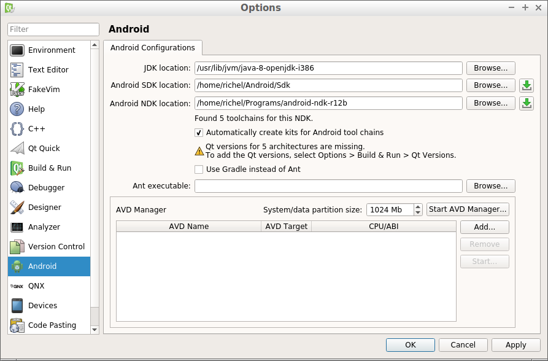
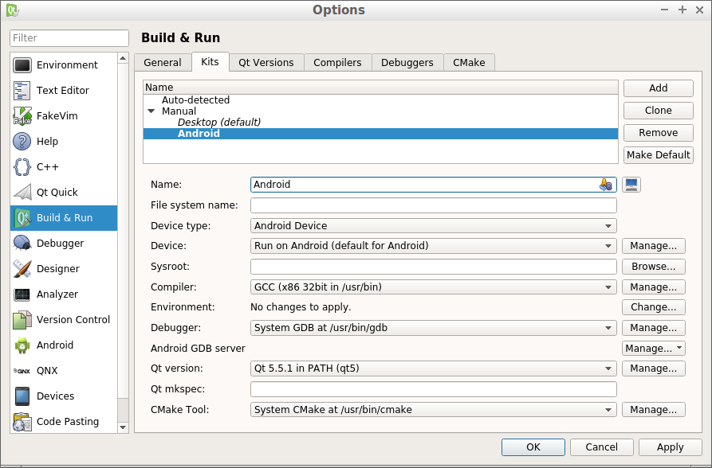
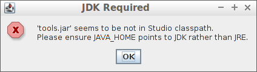

# Android
My notes on how to deploy to Android from within Qt Creator on GNU/Linux

## Prerequisites

### Java


Android Studio prefers Oracle Java, which is installed as such:

```
sudo apt-get install python-software-properties
sudo add-apt-repository ppa:webupd8team/java
sudo apt-get update
sudo apt-get install oracle-java8-installer
```

The alternative is to use OpenJDK:
```
sudo apt-get install openjdk-8-jdk
```

## Download Android Studio

Download the Android SDK called 'Android Studio' from [the download section of https://developer.android.com/studio](https://developer.android.com/studio/index.html#downloads).



After the file (in my case `android-studio-ide-143.2915827-linux.zip`) is downloaded:

 * unzip it.
 * `cd android-studio`
 * `cd bin`
 * `./studio.sh`

Just choose all default settings and quit Android Studio.



## Download the Android NDK

Download the Android NDK [from the download section of https://developer.android.com/ndk/index.html](https://developer.android.com/ndk/index.html#Downloads):



 * unzip it.

## Setup Qt Creator






### Error: JDK Required

```
JDK Required: 'tools.jar' seems to be not in Studio classpath.
Please ensure JAVA_HOME points to JDK rather than JRE.
```




#### Solution

```
sudo apt-get install openjdk-8-jdk
```

From [here](http://askubuntu.com/questions/296694/please-ensure-you-have-java-home-points-to-jdk-rather-than-jre-message#296699) I found to do 

```
sudo update-alternatives --set java /usr/local/java/jdk1.7.0_17/jre/bin/java
sudo update-alternatives --set javaws /usr/local/java/jdk1.7.0_17/jre/bin/javaws
```